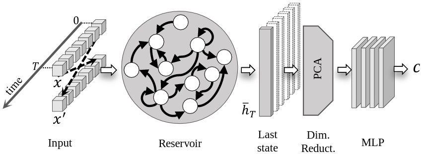

## Bidirectional Deep Echo State Network



Implementation in Tensorflow of the Bidirectional Deep Echo State Network (BDESN), proposed in [ref to Arxiv coming soon](). 

We perform classification on different multivariate time series dataset, publicly available from the [UCI](https://archive.ics.uci.edu/ml/datasets.html) and [UCR](http://www.cs.ucr.edu/~eamonn/time_series_data/) repository.
We also consider medical data, relative to patients from the University Hospital of North Norway, publicly available [here](https://groups.google.com/forum/#!topic/ml-news/MQtVkxizrrU).

We compare the classification accuracy and training time of the BDESN, with a standard Echo State Network (ESN) and a fully trained network, with a recurrent layer configured with Gated Recurrent Units (GRU).
Please, refer to the original manuscript for the implementation details.

The [code](https://github.com/FilippoMB/Bidirectional-Deep-Echo-State-Network/tree/master/code) folder contains 4 files:
* ```main.py```: script to execute a classification task using the BDESN architecture, a standard ESN and a GRU-based RNN.
* ```models.py```: contains methods to construct BDESN and the other RNN architectures considered for comparison.
* ```reservoir.py```: contains methods to generate and retrieve states form a reservoir.
* ```tf_utils.py```: contains methods for training some network components (the MLP in BDESN and GRU, and the recurrent layer in GRU only) with gradient descent.

### Experiments
-----
To run the experiments, execute the script [main.py](https://github.com/FilippoMB/Bidirectional-Deep-Echo-State-Network/blob/master/code/main.py).
To configure the experiment, modify the variables in the beginning of the file.

```python
dataset_name = 'LIB' # name of the dataset to process
n_runs = 5  # number of different random initializations for each method
use_seed = False  # set to False to generate different random initializations at each execution
plot_on = True  # set to false for textual output only

# Set True to train a classifier based on a given network
TRAIN_ESN = True
TRAIN_RNN = True
TRAIN_BDESN = True

```
If ``` n_runs > 1``` a mean and standard deviation will be returned for the accuracy and training time used by each method.
Available options for ```dataset_name``` are: ```'ECG'```, ```'LIB'```, ```'CHAR'```, ```'WAF'```, ```'JAP'```, ```'PHAL'``` and ```'BLOOD'```.
All the dataset used in the experiments are available in the [code](https://github.com/FilippoMB/Bidirectional-Deep-Echo-State-Network/tree/master/dataset) folder.

**Hyperparameters configurations**

The training of the three networks depends on several hyperparameters.
The ones which are kept fixed in each experiment are 

```python
# Parameters for GRU and BDESN
batch_size = 25  # samples in the mini-batches in gradient descent training
num_epochs = 5000  # number of epochs 
n_hidden_1 = 20  # size of 1st layer in MLP
n_hidden_2 = 20  # size of 2nd layer in MLP
n_hidden_3 = 10  # size of 3rd layer in MLP

# Parameters specific to GRU
cell_type = 'GRU'  # type of cell in the recurrent layer. Available options are 'RNN', 'GRU' and 'LSTM'
num_cells = 30  # size of the recurrent layer

# Parameters specific to BDESN
learning_rate_bdesn = 0.001  # learning rate in Adam optimizer
embedding_method = 'pca'  # dimensionality reduction method. Available options are 'identity', 'pca' and 'kpca'
n_dim = 30  # size of the space of reduced dimensionality
```

The other hyperparameters are optimized for each network according to the different classification tasks, and they are reported in the following.
To identify the optimal hyperparameters, a *random search* approach is used.
Since GRU depends on less hyperparameters, a total of 200 random configurations are evaluated.
Due to the larger number of hyperparameters in ESN and BDESN 500 random configurations are evaluated instead.
We also report the intervals where each parameter is sampled from, within the optimization procedure.

*ESN*

* <a href="https://www.codecogs.com/eqnedit.php?latex=N_r" target="_blank"></a>: size of the reservoir, randomly sampled from the set  *{750, 1000, 1250, 1500, 1750, 2000}*
* <a href="https://www.codecogs.com/eqnedit.php?latex=\beta" target="_blank"></a>: percentage of non-zero connections in the reservoir, uniformly sampled from the interval *[0.1, 0.6]*
* <a href="https://www.codecogs.com/eqnedit.php?latex=\rho" target="_blank"></a>: largest eigenvalue (spectral radius) of the reservoir, uniformly sampled from the interval *[0.5, 1.8]*
* <a href="https://www.codecogs.com/eqnedit.php?latex=\omega" target="_blank"></a>: scaling of the input weights, uniformly sampled from the interval *[0.01, 1.0]*
* <a href="https://www.codecogs.com/eqnedit.php?latex=\xi" target="_blank"></a>: random noise in the state update of the reservoir, uniformly sampled from the interval *[0, 0.1]*
* <a href="https://www.codecogs.com/eqnedit.php?latex=\lambda_r" target="_blank"></a>: Regularization coefficient for ridge regression. The value is set to 2^c, with c uniformly sampled from the interval *[-5.0, 5.0]*

Dataset | <a href="https://www.codecogs.com/eqnedit.php?latex=N_r" target="_blank"></a> | <a href="https://www.codecogs.com/eqnedit.php?latex=\beta" target="_blank"></a> | <a href="https://www.codecogs.com/eqnedit.php?latex=\rho" target="_blank"></a> | <a href="https://www.codecogs.com/eqnedit.php?latex=\omega" target="_blank"></a> | <a href="https://www.codecogs.com/eqnedit.php?latex=\xi" target="_blank"></a> | <a href="https://www.codecogs.com/eqnedit.php?latex=\lambda_r" target="_blank"></a>
--- | ---| --- | --- | --- | --- | ---
DistPhal | 1500 | 0.33 | 1.49 | 0.9 | 0.06 | 2.12
ECG | 1000 | 0.47 | 1.09 | 0.568 | 0.062 | 1.071
Libras | 1750 | 0.564 | 1.143 | 0.133 | 0.019 | 0.875
Char. Traj. | 1750 | 0.517 | 1.13 | 0.216 | 0.018 | 4.91
Wafer | 1000 | 0.54 | 1.14 | 0.11 | 0.003 | 15.79
Jp. Vow. | 1250 | 0.375 | 1.029 | 0.031 | 0.03 | 1.12
Blood | 750 | 0.17 | 1.14 | 0.587 | 0.094 | 16.44 

**GRU**

* <a href="https://www.codecogs.com/eqnedit.php?latex=\gamma" target="_blank"></a>: learning rate in Adam optimizer, uniformly sampled from the interval *[0.0001, 0.001]*
* <a href="https://www.codecogs.com/eqnedit.php?latex=\lambda_r" target="_blank"></a>: L2 regularization weight in loss function. The value is set to 10^c, with c uniformly sampled from the interval *[-5.0, -1.0]*
* <a href="https://www.codecogs.com/eqnedit.php?latex=p_\text{drop}" target="_blank"></a>: dropout (keep) probability in MLP, uniformly sampled from the interval *[0.6, 1.0]*

Dataset | <a href="https://www.codecogs.com/eqnedit.php?latex=\gamma" target="_blank"></a> | <a href="https://www.codecogs.com/eqnedit.php?latex=\lambda_r" target="_blank"></a> | <a href="https://www.codecogs.com/eqnedit.php?latex=p_\text{drop}" target="_blank"></a>
--- | --- | --- | ---
DistPhal | 4.9E-4 | 2.2E-4 | 0.85
ECG | 7.9E-4 | 1.6E-5 | 0.67
Libras | 9.5E-4 | 1.29E-5 | 0.8
Char. Traj. | 8E-4 | 9.2E-5 | 0.92
Wafer | 8E-4 | 3E-4 | 0.76
Jp. Vow. | 0.001 | 2.8E-5 | 0.9
Blood | 9.5E-4 | 2.7E-4 | 0.6

**BDESN**

(see above for the descriptions of the hyperparameters and their sampling intervals)

Dataset | <a href="https://www.codecogs.com/eqnedit.php?latex=N_r" target="_blank"></a> | <a href="https://www.codecogs.com/eqnedit.php?latex=\beta" target="_blank"></a> | <a href="https://www.codecogs.com/eqnedit.php?latex=\rho" target="_blank"></a> | <a href="https://www.codecogs.com/eqnedit.php?latex=\omega" target="_blank"></a> | <a href="https://www.codecogs.com/eqnedit.php?latex=\xi" target="_blank"></a> | <a href="https://www.codecogs.com/eqnedit.php?latex=\lambda_r" target="_blank"></a> | <a href="https://www.codecogs.com/eqnedit.php?latex=p_\text{drop}" target="_blank"></a>
--- | ---| --- | --- | --- | --- | --- | ---
DistPhal | 1000 | 0.33 | 1.12 | 0.47 | 0.07 | 0.022 | 0.96
ECG | 1500 | 0.403 | 1.179 | 0.082 | 1.81E-5 | 3.1E-4 | 0.73
Libras | 750 | 0.41 | 1.017 | 0.069 | 0.016 | 1.8E-05 | 0.87
Char. Traj. | 1750 | 0.347 | 1.015 | 0.023 | 0.0259 | 0.008 | 0.89
Wafer | 1750 | 0.2 | 1.13 | 0.104 | 0.027 | 7.8E-5 | 0.82
Jp. Vow. | 1500 | 0.118 | 1.28 | 0.142 | 0.082 | 0.002 | 0.95
Blood | 1000 | 0.517 | 1.47 | 0.044 | 0.0103 | 0.0021 | 0.62


Once the optimal hyperparameters are identified, each network is trained 10 times, using random and independent initializations of the weights.
GRU and BDESN are trained for 5000 epochs using mini-batches of size 25.
